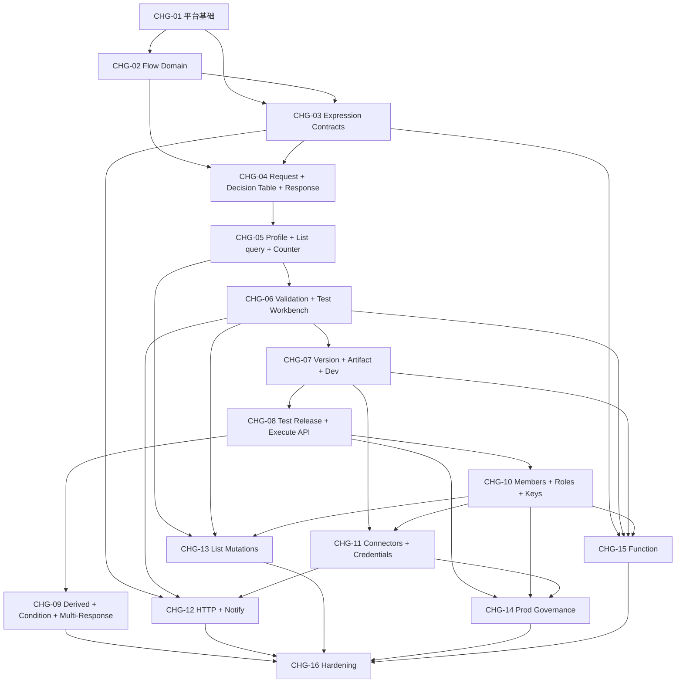

# Change Dependency Graph

## 1. 主依赖图



## 2. 推荐推进波次

### Wave 0：前置 Spike

- Zen-derived 核心模型
- CEL 跨语言语义
- Counter 原子窗口
- Artifact 分发与指针
- Function 隔离
- 日志可靠路径

并非所有 Spike 都阻塞 CHG-01；具体关系见 Engineering Index。

### Wave 1：平台和共享契约

```text
CHG-01 -> CHG-02 -> CHG-03
```

### Wave 2：P0 决策能力

```text
CHG-04 -> CHG-05 -> CHG-06
```

### Wave 3：P0 治理和接入

```text
CHG-07 -> CHG-08
```

CHG-08 完成后达到 P0。

### Wave 4：完整 MVP 的基础治理与表达

```text
CHG-09
CHG-10
```

CHG-09 与 CHG-10 可以并行，因为一个扩展流程表达，一个建立正式权限和 Key 生命周期。

### Wave 5：资源与副作用

```text
CHG-10 -> CHG-11 -> CHG-12
CHG-10 -> CHG-13
```

CHG-12 和 CHG-13 可以在 CHG-11/CHG-10 满足后并行。

### Wave 6：Prod 与 Function

```text
CHG-14
CHG-15
```

两者均使用正式权限模型；Function 还受 SPK-05 阻塞。

### Wave 7：完整 MVP 硬化

```text
CHG-16
```

## 3. 关键依赖说明

### Decision Table 不得拆散

CHG-04 同时建立 Request、Decision Table 和 Response 的完整规范与运行语义。Decision Table 不是后续可选补充，否则最小决策切片无法验证。

### 事实节点必须自带资源前置

CHG-05 同时建立系统内置画像源目录、环境名单资源、Profile Query、List(query) 和 Counter。因此不会出现节点已进入流程但资源尚未存在的情况。

### 权限先于高风险 P1 能力

CHG-10 在连接器、名单真实写、Prod 和 Function 之前建立正式角色、高风险能力和 Key 生命周期，避免这些 Change 先使用临时管理员特例再返工授权。

### 版本与资源治理分层

CHG-07 先建立通用 Version/Artifact/Pointer。CHG-11 再把连接器、凭据和环境资源解析接入，不反向改变基本对象关系。

### Function 不阻塞 P0

CHG-15 不被任何 P0 Change 依赖。Function Spike 失败时可以后移或调整实现边界，而不返工 P0。
