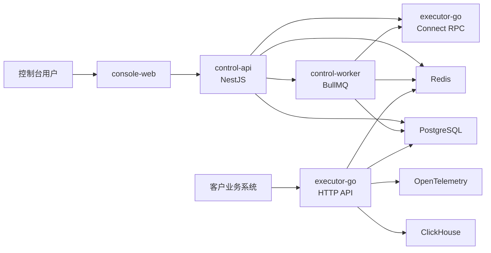

# 决策引擎 SaaS MVP 技术架构设计文档

## 0. 文档状态

- 日期：2026-05-24
- 状态：开发启动前技术架构基线
- 产品依据：`docs/plans/2026-02-27-decision-engine-saas-design.md`
- 范围：完整 MVP，而不是仅覆盖 P0 垂直切片

本文是决策引擎 SaaS 的独立技术架构设计文档。产品范围、页面与节点语义以产品基线文档为准；本文只定义 MVP 阶段的技术选型、服务边界、数据架构、执行架构、安全方案、部署方案和测试策略。

MVP 的实施可以按 P0/P1 分阶段交付，但技术架构必须覆盖完整 MVP：11 类节点、控制台编排、节点验证、整流测试、版本快照、Test/Prod 发布治理、审批、回滚、资源与凭据管理、审计、执行日志、基础指标和外部 HTTP API 接入。

## 1. 架构目标

### 1.1 目标

- 支持公有云多租户 SaaS 首发，架构预留私有化交付能力。
- 控制面与执行面分离，避免控制台、审批和后台任务影响实时决策 SLA。
- 复用既有执行引擎资产：执行核心基于 GoRules ZEN Engine 改进版的内部 Go 引擎。
- 控制台侧优先保证产品模型表达力、治理闭环和开发效率。
- 执行侧优先保证低延迟、高可用、可解释日志和资源隔离。
- 所有发布到 Test/Prod 的运行产物必须可追溯、可回滚、可审计。

### 1.2 非目标

- MVP 不从零自研通用工作流引擎。
- MVP 不引入微服务化拆分控制面。
- MVP 不绑定单一云厂商能力。
- MVP 不提供实时监控控制台页面，但必须采集基础指标。
- MVP 不提供线上请求回放调试页面，但必须产出结构化执行日志。

## 2. 已确认技术选型

| 领域 | 选型 | 说明 |
| --- | --- | --- |
| 产品交付形态 | 公有云多租户 SaaS 优先 | 架构预留私有化部署 |
| 仓库组织 | pnpm monorepo | 前端、控制面、共享包、proto 和 Go 执行面同仓管理 |
| 前端 | React + Vite + React Router | 登录后控制台 SPA，不做 SSR |
| 画布 | React Flow | 承载流程图编排、节点和连线交互 |
| UI 组件库 | Ant Design | 适合中文企业后台、复杂表格和表单 |
| 控制面后端 | NestJS 模块化单体 | 控制面复杂治理逻辑集中在一个进程边界内分模块组织 |
| ORM | Prisma | PostgreSQL 建模、迁移和 TypeScript 类型体验优先 |
| 执行面 | Go 服务 | 嵌入基于 GoRules ZEN Engine 改进的既有引擎 |
| 内部协议 | Connect RPC / Protobuf | 固定 TypeScript 控制面与 Go 执行面契约 |
| 主库 | PostgreSQL | 控制面强一致治理数据和复杂 JSONB 快照 |
| 运行态存储 | Redis | 名单、Counter、缓存、限流和 BullMQ |
| 异步任务 | BullMQ | 发布后预热、资源影响分析、日志补偿等后台任务 |
| 执行日志 | ClickHouse | 高频结构化运行日志与后续离线分析 |
| 指标/追踪 | OpenTelemetry + Prometheus/Grafana | 内部运维观测基础 |
| 表达式 | CEL 风格表达式 | 受控、可解释、可做类型校验；Go 运行时语义为准 |
| Function 沙箱 | Goja 或同类纯 Go JS VM | 运行在 Go 执行面内，禁用宿主 IO |
| 密钥保护 | Envelope encryption + KMS Provider 预留 | API Key 用 hash 校验并以密文支持高权限复制，连接器凭据可解密运行 |
| 部署 | Docker Compose 开发/演示，Kubernetes 生产 | 生产优先托管 PostgreSQL/Redis/ClickHouse |

## 3. 总体架构

MVP 运行态拆为 4 类应用：

1. `console-web`：React 控制台，承载决策流、版本发布、审批中心、数据与集成、组织权限、审计合规等页面。
2. `control-api`：NestJS 控制面 API，负责租户、权限、Draft、版本、发布、审批、资源、凭据、API Key、审计和编译入口。
3. `control-worker`：NestJS worker，使用 BullMQ 执行后台任务。
4. `executor-go`：Go 实时执行服务，嵌入 Zen-derived 引擎，承载客户侧决策调用、控制台节点验证、整流测试和执行日志写出。

控制台只调用 `control-api`。外部客户决策请求直接进入 `executor-go`，不经过 `control-api`，避免控制面进入实时决策主链路。



## 4. Monorepo 结构

建议目录结构：

```text
apps/
  console-web/        # React + Vite 控制台
  control-api/        # NestJS API 进程
  control-worker/     # NestJS BullMQ worker 进程
  executor-go/        # Go 执行服务
packages/
  shared/             # TypeScript 共享类型、常量、校验辅助
  proto/              # Protobuf/Connect RPC 契约
  config/             # 共享工程配置
  eslint-config/      # 前端/后端 lint 配置
  tsconfig/           # TypeScript 基础配置
infra/
  docker-compose/     # 本地和演示环境
  k8s/                # 生产部署清单或 Helm chart
  migrations/         # 数据库迁移入口，Prisma 为主
docs/
  plans/              # 产品与技术设计文档
```

TypeScript 包使用 `pnpm` workspace 管理。Go 执行面作为同仓独立应用，通过 `packages/proto` 生成 Go 与 TypeScript 双端代码。

## 5. 服务边界

### 5.1 console-web

职责：

- 控制台页面、路由、权限态展示。
- React Flow 画布、节点库、节点编辑器、问题面板、整流测试工作台。
- Value Editor、Expression Editor、Schema Editor、Diff Viewer、JSON Viewer 等共享编辑组件。

边界：

- 不直接访问数据库、Redis、ClickHouse 或执行面公开 HTTP API。
- 不在前端自行决定提审门禁、版本生成、资源指纹或发布一致性。
- 可做即时 UI 级校验，但最终语义以后端校验为准。

### 5.2 control-api

职责：

- 控制台 REST API 与 OpenAPI 文档。
- 租户、成员、角色、高风险能力与 JWT Session。
- 决策流 Draft、版本快照、Dev Active Build、Test/Prod 生效指针。
- 发布申请、审批、发布确认、回滚。
- 资源定义、凭据、API Key、审计日志。
- 产品配置模型到执行产物的编译入口。
- 通过 Connect RPC 调用执行面完成节点验证、整流测试、产物预热和健康检查。

边界：

- 不承载外部客户实时决策流量。
- 不直接执行决策流节点逻辑。
- 不绕过执行面返回节点验证或整流测试结果。

### 5.3 control-worker

职责：

- 发布后产物预热。
- 资源影响范围分析。
- 凭据轮换影响分析。
- 审计异步补充。
- ClickHouse 执行日志投递补偿。
- 队列重试、失败任务记录和运维指标。

边界：

- 可复用 `control-api` 的业务模块代码，但以独立进程部署。
- 不处理用户同步请求。

### 5.4 executor-go

职责：

- 外部 HTTP 决策 API。
- 内部 Connect RPC 执行接口。
- API Key 校验、环境解析、租户限流。
- 按 `(tenant_id, flow_id, env)` 加载 Dev Active Build 或 Test/Prod 当前版本。
- 调用 Zen-derived 引擎执行决策产物。
- 读取 Redis 名单和 Counter。
- 解析资源、凭据和连接器运行配置。
- 执行 HTTP、Notify、Function 等节点运行时能力。
- 异步写出结构化执行日志和指标。

边界：

- 不修改 Draft、版本、审批、资源定义和权限配置。
- 不承担控制面治理。
- 对 PostgreSQL 只做运行所需的只读查询和缓存加载。

## 6. 控制面模块划分

`control-api` 采用 NestJS 模块化单体：

- `IdentityModule`：登录、JWT Session、租户上下文、成员状态。
- `AccessControlModule`：全局角色、高风险能力、权限 Guard、二次确认。
- `DecisionFlowModule`：项目收纳、决策流列表、Draft 保存、画布校验、节点验证入口、整流测试入口、从历史版本重建 Draft。
- `VersionModule`：版本生成、版本快照、版本 Diff、资源指纹固化、Dev Active Build 生成。
- `ReleaseModule`：Test/Prod 发布申请、发布确认、当前生效指针切换、回滚、发布失败记录。
- `ApprovalModule`：审批中心列表、审批详情、通过、驳回、撤销、审批快照。
- `ResourceModule`：系统内置画像源目录、名单资源、HTTP 连接器、通道连接器、受保护状态、影响范围。
- `CredentialModule`：凭据对象、凭据版本、active 切换、envelope encryption、凭据影响分析。
- `ApiKeyModule`：Dev/Test/Prod 环境级 API Key、当前/备用 Key、生成、提升、停用、哈希元数据。
- `AuditModule`：审计事件写入、查询、详情和脱敏摘要。
- `CompilerModule`：产品模型编译、静态校验、执行产物摘要和 hash。
- `ExecutorClientModule`：Connect RPC 客户端封装。
- `JobModule`：BullMQ 队列、任务注册、重试和失败处理。

所有写操作必须进入审计。关键高风险操作必须经过权限 Guard 和二次确认。

## 7. 数据与存储架构

### 7.1 PostgreSQL

PostgreSQL 是控制面唯一主库，保存强一致治理数据：

- 租户、成员、角色、高风险能力。
- 决策流、项目归类、Draft、版本快照、Dev Active Build、环境生效指针。
- 发布申请、审批快照、发布记录、回滚记录。
- 名单资源、HTTP 连接器、通道连接器、系统内置画像源目录元数据。
- 凭据对象、凭据版本元数据和密文。
- API Key 哈希、加密密文、短指纹、环境、状态和审计元数据。
- 审计日志索引与详情。

复杂配置使用 `JSONB`：

- React Flow 图结构。
- 节点配置。
- 表达式 token。
- Request/Response Schema。
- 决策表列模型和规则行。
- 版本快照。
- 审批快照。
- 执行产物摘要。

治理查询字段必须使用关系列和索引，例如 `tenant_id`、`flow_id`、`env`、`status`、`created_at`、`resource_type`。

### 7.2 Redis

Redis 承载低延迟运行态：

- 名单 key 集合和 TTL。
- Counter 时间窗口统计。
- 环境生效版本/Build 指针缓存。
- API Key 校验缓存。
- 版本产物加载缓存辅助。
- 租户级限流。
- BullMQ 队列和任务状态。

Redis key 必须包含租户命名空间，运行态 key 至少包含 `tenant_id`，涉及决策执行的状态必须包含 `tenant_id:flow_id:env`。

### 7.3 ClickHouse

ClickHouse 保存结构化执行日志：

- `request_id`、`tenant_id`、`flow_id`、`env`、`version_id/build_id`。
- API Key 指纹、项目归属快照。
- 请求开始/结束时间、总耗时、最终状态。
- 命中 Response 节点、最终响应摘要、错误码和错误原因摘要。
- 节点执行路径、节点状态、耗时、关键输入输出摘要。
- 外呼、通知、降级、副作用和资源指纹摘要。

执行日志写入不阻塞决策响应。写入失败只影响内部运维指标和补偿任务，不改变本次业务响应。

### 7.4 指标与追踪

OpenTelemetry 统一采集：

- 控制面 API 延迟、错误率。
- BullMQ 队列积压、任务失败、重试次数。
- 执行面 QPS、p95/p99、错误率、超时率。
- 节点耗时、降级率、外呼失败率、通知提交失败率。

Prometheus/Grafana 用于内部运维。MVP 控制台不建设实时监控页面。

## 8. 决策流版本产物与编译架构

控制台保存产品配置模型，执行面运行引擎可执行模型。两者之间必须通过 `CompilerModule` 转换。

### 8.1 编译输入

编译输入包括：

- 决策流图：节点、连线、坐标和节点类型。
- 节点配置：11 类节点的配置模型。
- Request 输入 Schema 与测试样例值。
- Response 共享输出契约。
- 表达式 token 与稳定 `namespaceKey` 引用。
- 资源引用：名单、画像源、HTTP 连接器、通道连接器、凭据引用。
- 环境和运行策略：异常策略、超时、重试、沙箱限制。

### 8.2 编译输出

编译输出是执行产物：

- 引擎模型：Zen-derived 引擎可加载的 JSON Decision Model 或内部等价模型。
- 运行元数据：tenant、flow、env、version/build、节点 ID 映射、namespaceKey 映射。
- 资源绑定：资源引用清单、资源指纹、内置画像源字段目录版本。
- 日志映射：节点名称、节点类型、输入输出摘要策略、脱敏策略。
- 安全策略：Function 沙箱限制、超时、输出大小、外呼约束。
- 产物 hash：用于预热、缓存、发布一致性和审计追溯。

### 8.3 静态校验

编译前后必须完成静态校验：

- 有且仅有一个 Request。
- 至少一个 Response，所有可达分支最终到达 Response。
- 无环路、无不可达节点、无孤岛分支。
- 表达式语法和类型校验通过。
- 节点专属校验通过。
- 资源引用存在且可用于目标环境。
- 高风险节点与副作用节点满足权限和风险要求。
- 生成版本时记录资源指纹；发布时校验指纹一致。

### 8.4 Draft 测试与版本运行

节点验证和整流测试使用临时执行产物：

1. 前端触发执行。
2. `control-api` 强制保存 Draft。
3. `CompilerModule` 编译临时产物。
4. `ExecutorClientModule` 通过 Connect RPC 调用 `executor-go`。
5. 执行结果回写为当前会话结果和最近一次节点验证状态。

正式运行使用不可变版本产物：

1. Draft 通过门禁后生成不可变版本快照。
2. 版本快照编译正式产物并记录 hash。
3. 发布到环境时原子替换 Dev/Test/Prod 生效指针。
4. `executor-go` 按环境指针加载对应产物。

## 9. 执行面架构

`executor-go` 是实时决策服务，核心是既有 Zen-derived Go 引擎。

### 9.1 请求路由

外部客户调用：

1. 客户通过 HTTP API 提交 `flow_id` 与请求体。
2. `executor-go` 校验 API Key hash，解析 `tenant_id` 和 `env`。
3. 若请求携带 `X-Env`，必须与 API Key 绑定环境一致。
4. 执行面按 `(tenant_id, flow_id, env)` 查询生效指针。
5. `dev` 命中 Dev Active Build，`test/prod` 命中当前生效版本。
6. 未部署时返回明确错误，不回退 Draft 或其他环境。

### 9.2 运行时能力

执行面负责：

- Request Schema 校验。
- 表达式求值。
- Condition、Decision Table、Response 等纯计算节点。
- Profile Query 调用系统内置画像源适配器。
- List 读取或写入 Redis 名单。
- Counter 读取 Redis 窗口统计。
- HTTP 节点调用外部连接器。
- Notify 节点提交通知请求。
- Function 节点通过 Goja 类沙箱执行。
- 节点异常策略、降级策略、超时和输出大小限制。

### 9.3 资源解析

资源定义不做用户可见版本，但版本产物记录资源指纹。执行时：

- 名单、连接器等行为字段以受保护资源机制保证不可原地破坏当前 Test/Prod 运行语义。
- 发布时校验审批后的资源指纹与当前资源定义一致。
- 凭据 active 版本允许独立轮换；执行日志记录实际凭据版本指纹。
- 内置画像源记录画像源标识和字段目录版本。

### 9.4 Function 沙箱

Function 节点采用 Goja 或同类纯 Go JS VM：

- 入口固定为 `async handler(input)` 的受控单文件模块语义。
- 编译阶段对 ESM/import 做静态检查和适配。
- 仅允许 ECMAScript 内建能力和平台白名单模块。
- 禁止 `fetch`、文件系统、环境变量、动态 `import()`、相对/绝对路径导入、宿主进程对象。
- 强制超时、内存限制、输出大小限制。
- 错误返回类型、消息、源码行列号和简化堆栈。

## 10. API 与协议

### 10.1 控制台 REST API

`control-api` 对 `console-web` 提供 REST API，并生成 OpenAPI 文档。API 必须统一：

- 租户上下文。
- 权限错误模型。
- 表单校验错误模型。
- 审计 request id。
- 幂等写操作约束。

### 10.2 外部决策 HTTP API

`executor-go` 对客户业务系统提供 HTTP API：

- 鉴权：环境级 API Key。
- 路由：请求体或路径中指定 `flow_id`。
- 环境：由 API Key 绑定环境决定。
- 响应：成功返回 Response 节点映射结果；系统错误返回统一错误结构。
- 可追溯：每次响应包含或可关联 `request_id/trace_id`。

### 10.3 内部 Connect RPC

`control-api/control-worker` 与 `executor-go` 通过 Connect RPC / Protobuf 通信。首版接口至少包括：

- `ExecuteArtifact`：执行临时或正式产物，用于节点验证与整流测试。
- `WarmArtifact`：预热版本产物。
- `InvalidateArtifact`：失效缓存。
- `HealthCheck`：执行面健康检查。

Protobuf 契约必须纳入 CI 兼容性检查。

## 11. 前端架构

`console-web` 按业务域组织：

- `flows`：决策流列表、项目收纳、画布、节点库、问题面板、整流测试。
- `versions`：版本与发布首页、版本详情、环境卡、发布确认、回滚。
- `approvals`：审批中心列表、详情、通过、驳回。
- `resources`：画像源目录、名单、HTTP 连接器、通道连接器、凭据、接入设置。
- `org`：成员、角色、高风险能力。
- `audit`：操作日志查询与详情。
- `shared`：API client、权限组件、编辑器、Diff 和 JSON 展示组件。

画布状态分三层：

1. React Flow 视图状态：坐标、缩放、选中、高亮。
2. Draft 编辑状态：节点配置、连线、表达式 token、输出契约、测试样例值。
3. 服务端持久状态：Draft revision、dirty 状态、最近一次校验和验证结果。

节点编辑器采用统一三栏容器：

- 左栏：变量引用面板，由后端返回当前节点前序可达变量模型。
- 中栏：节点专属配置表单，所有值输入统一使用 `Value Editor(Fixed/Expression)`。
- 右栏：当前节点最近一次验证结果。

表达式 token 在 UI 中不可拆分，底层保存稳定引用，不依赖节点显示名。

## 12. 安全、权限与密钥

### 12.1 身份与权限

MVP 使用内置账号体系 + JWT Session。数据模型预留外部身份字段，后续可接 OIDC/SAML。

权限分为：

- 全局角色：只读成员、编辑成员、发布成员、审批成员、管理员。
- 高风险能力：`Function 编辑`、`凭据管理`、`连接器管理`、`名单数据维护`、`API Key 管理`、`权限管理`。

所有控制面请求必须解析 `tenant_id` 和 `user_id`。所有业务查询强制租户过滤。

### 12.2 API Key

API Key 按环境管理：

- Dev：当前 Key + 备用 Key。
- Test：当前 Key + 备用 Key。
- Prod：当前 Key + 备用 Key。

完整 Key 允许具备 `API Key 管理` 高风险能力的用户在二次确认后复制。数据库不保存明文，保存 hash、加密密文、短指纹、环境、状态、创建人、停用时间和审计元数据。执行面校验只使用 hash；控制台复制完整 Key 时通过 envelope encryption 解密，并写入强审计。

### 12.3 凭据加密

凭据采用 envelope encryption：

- API Key 用 hash 校验，不保存明文；为满足控制台复制完整 Key，另保存 envelope encryption 加密密文。
- HTTP/通知连接器凭据保存加密密文。
- MVP 可使用应用级主密钥或环境密钥。
- 加密接口预留 KMS Provider，后续可接云 KMS/HSM。
- 日志和审计只记录凭据版本摘要或指纹。

### 12.4 多租户隔离

- PostgreSQL 表必须包含 `tenant_id`。
- Redis key 必须包含租户命名空间。
- ClickHouse 日志必须包含 `tenant_id`。
- 执行面缓存、限流和产物加载必须按租户隔离。
- 项目只作为决策流分类，不参与权限、运行或存储隔离。

## 13. 部署架构

### 13.1 本地与演示

Docker Compose 拉起：

- PostgreSQL。
- Redis。
- ClickHouse。
- `control-api`。
- `control-worker`。
- `executor-go`。
- `console-web`。

开发时允许前端 Vite dev server 独立运行，后端和基础设施仍由 Compose 提供。

### 13.2 生产

生产部署在 Kubernetes：

- `console-web`：静态资源服务或前端容器。
- `control-api`：多副本，无状态。
- `control-worker`：独立副本，按队列压力扩缩。
- `executor-go`：多副本，按 QPS、延迟和 CPU 扩缩。

PostgreSQL、Redis、ClickHouse 和对象存储优先使用托管服务，但不在应用架构中绑定具体云厂商。

发布产物时：

1. 写入 PostgreSQL 版本和产物摘要。
2. Worker 调用执行面预热产物。
3. 发布确认时原子切换环境生效指针。
4. 执行面通过缓存失效或版本指针变更加载新产物。

## 14. 测试策略

### 14.1 前端测试

- Vitest + Testing Library 覆盖表单、编辑器和权限态组件。
- React Flow 关键交互使用组件测试和 Playwright 组合覆盖。
- Playwright 覆盖完整控制台主链路。

### 14.2 控制面测试

- NestJS 单元测试覆盖模块 service。
- 集成测试覆盖 Prisma/PostgreSQL 事务、权限 Guard、发布申请、资源保护、凭据轮换和审计。
- 编译器测试覆盖产品模型到执行产物转换。

### 14.3 执行面测试

- Go test 覆盖节点执行、资源读取、表达式求值、Function 沙箱、日志摘要和错误模型。
- 使用固定版本产物 fixture 验证 Zen-derived 引擎适配。
- Redis/ClickHouse 相关能力使用集成测试覆盖关键路径。

### 14.4 契约与 E2E

- Protobuf/Connect RPC 契约纳入 CI。
- E2E 至少覆盖：
  1. 创建名单资源。
  2. 创建决策流。
  3. 配置 `Request -> Profile Query -> List(query) -> Counter -> Decision Table -> Response`。
  4. 执行到节点。
  5. 画布整流测试。
  6. 生成版本。
  7. 发起 Test 申请并自动通过。
  8. 发布 Test。
  9. 外部 API 调用命中 Test 当前生效版本。

完整 MVP 还需要补充 HTTP、Notify、Function、Prod 审批发布、回滚、凭据轮换、API Key 轮换和审计查询的 E2E 场景。

## 15. MVP 风险与约束

### 15.1 双语言契约风险

控制面 TypeScript，执行面 Go。必须通过 Protobuf、契约测试和固定 fixture 降低模型漂移风险。

### 15.2 表达式一致性风险

编辑态校验在 TypeScript，运行态求值在 Go。运行语义以 Go 执行面为准；TypeScript 校验必须通过共享表达式规范和测试 fixture 对齐。

### 15.3 资源指纹与凭据轮换边界

资源行为字段通过指纹保护；凭据 active 版本允许独立轮换。执行日志必须记录实际资源指纹和凭据版本指纹，避免事后无法追溯。

### 15.4 Function 沙箱复杂度

Function 节点是高风险逃生口，不是常规路径。MVP 必须限制宿主能力、输出大小、超时和白名单模块，避免把 Function 做成无边界脚本平台。

### 15.5 ClickHouse 运维成本

ClickHouse 引入额外组件，但可以避免高频执行日志冲击 PostgreSQL。MVP 控制台不查询执行日志时，ClickHouse 先服务离线分析和内部排障。

## 16. 开发启动验收口径

技术架构进入实施阶段前，需满足：

- monorepo 基础结构可创建。
- Docker Compose 能拉起 PostgreSQL、Redis、ClickHouse、控制面和执行面。
- Protobuf 契约能生成 TypeScript 与 Go 代码。
- 控制面能保存 Draft，并编译至少核心六节点产物。
- 执行面能加载产物并跑通核心六节点链路。
- Test 发布能原子切换环境指针。
- 外部 API 能按 API Key 解析租户和环境。
- 审计日志进入 PostgreSQL。
- 执行日志进入 ClickHouse 或补偿队列。
- 基础指标通过 OpenTelemetry 暴露。

## 17. 后续扩展预留

- OIDC/SAML 企业身份接入。
- 云 KMS/HSM 密钥管理。
- 私有化部署 Helm chart 与离线安装包。
- 自定义画像源。
- 回放调试与请求级轨迹页面。
- 实时监控控制台页面。
- 灰度发布、A/B 实验和策略效果评估。
- 节点生态开放与第三方扩展。
