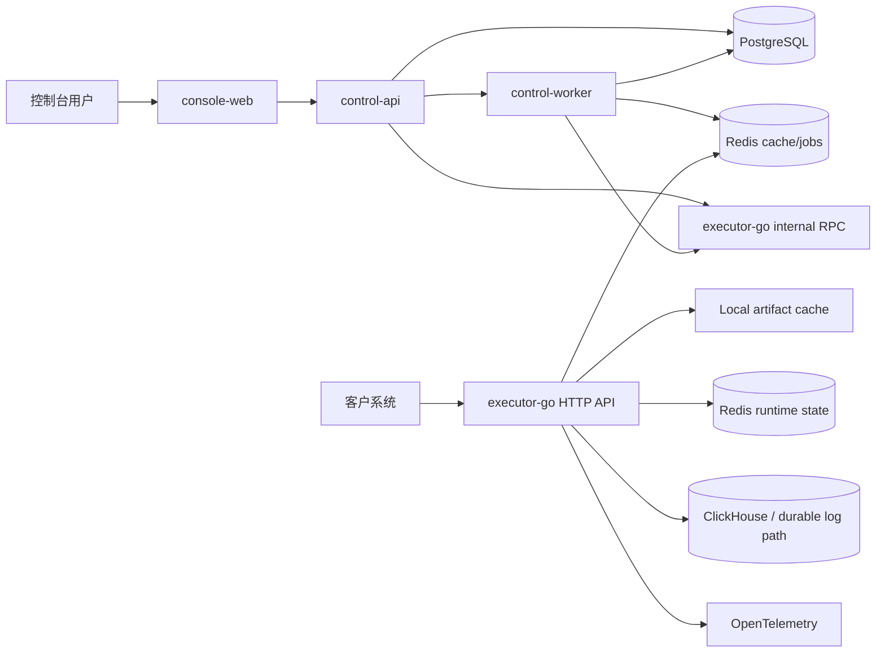

# 决策引擎 SaaS MVP 技术架构基线

## 0. 文档状态与边界

- 文档版本：2026-08-02
- 文档状态：阶段 1 架构语义基线
- 产品依据：`docs/2026-02-27-decision-engine-saas-design.md`
- 适用范围：P0、P1 与完整 MVP
- 下游用途：作为 Change Capability Framework 的架构输入和阶段 3 全局工程设计的上游约束

本文确定系统边界、关键技术选型、全局架构不变量、核心数据流、安全原则、可靠性目标和技术风险。它不预先定义每个 Change 的数据库表、API DTO、Proto 字段、Redis 命令或文件结构；这些由阶段 3 的全局工程基线和后续 OpenSpec Change `design.md` 逐步固化。

---

## 1. 架构目标与非目标

### 1.1 目标

- **ARC-GOAL-001**：公有云多租户 SaaS 首发，架构预留私有化交付。
- **ARC-GOAL-002**：控制面与实时执行面分离，控制台故障不进入正常决策热路径。
- **ARC-GOAL-003**：复用基于 GoRules ZEN Engine 改进的内部 Go 执行引擎。
- **ARC-GOAL-004**：产品配置、不可变版本、环境 Artifact 和生效指针可追溯。
- **ARC-GOAL-005**：跨 TypeScript 与 Go 的模型、表达式和错误语义可验证一致。
- **ARC-GOAL-006**：租户、环境、运行状态和外联资源具有明确隔离边界。
- **ARC-GOAL-007**：发布、回滚、审计和执行日志在部分故障下保持可恢复。
- **ARC-GOAL-008**：P0 先完成六节点垂直切片，架构不阻断 P1 的完整 MVP。

### 1.2 非目标

- MVP 不从零自研通用工作流调度平台。
- MVP 不将控制面拆成多个独立微服务。
- MVP 不在执行热路径强依赖控制面 API。
- MVP 不绑定单一云厂商。
- MVP 不建设客户可见实时监控或请求回放页面。
- MVP 不支持流程并行、隐式 Merge 和循环。
- MVP 不开放任意用户代码宿主能力。

---

## 2. 全局架构不变量

以下约束跨所有 Change 生效。

### 2.1 控制面与执行面

- **ARC-INV-001**：控制台只调用控制面 API；客户实时决策请求直接进入 Go 执行面。
- **ARC-INV-002**：控制面负责 Draft、版本、资源、审批、权限、审计和编译编排，不直接执行节点逻辑。
- **ARC-INV-003**：执行面只读取运行所需配置和状态，不修改 Draft、版本、审批或权限。
- **ARC-INV-004**：控制面不可用时，执行面应继续运行已经加载和缓存的生效 Artifact。

### 2.2 权威数据和缓存

- **ARC-INV-005**：PostgreSQL 是控制面治理对象、版本、部署和生效指针的权威事实源。
- **ARC-INV-006**：Redis 缓存和本地缓存不得成为发布治理的唯一事实源。
- **ARC-INV-007**：执行请求正常热路径不得每次访问 PostgreSQL；本地 Artifact 缓存优先，缓存缺失通过受控加载路径恢复。
- **ARC-INV-008**：运行状态、缓存、队列和限流至少使用独立逻辑命名空间；生产部署应支持按风险拆分实例。

### 2.3 版本和产物

- **ARC-INV-009**：Flow Version 环境无关，Compiled Artifact 环境相关。
- **ARC-INV-010**：Artifact 必须由明确 Draft revision 或 Flow Version、目标环境、编译器版本和资源解析结果确定。
- **ARC-INV-011**：发布只切换环境 Active Pointer；切换失败不得破坏上一指针。
- **ARC-INV-012**：历史 Flow Version 和成功 Artifact 不得被原地修改。

### 2.4 流程和节点

- **ARC-INV-013**：控制台、控制面校验器、编译器和执行面共享同一 canonical flow model。
- **ARC-INV-014**：节点稳定标识、`namespaceKey` 和配置 Schema 版本必须跨保存、版本和重建保持可追溯。
- **ARC-INV-015**：MVP 图模型不允许隐式汇合、并行和循环。
- **ARC-INV-016**：动态输出 Schema 是 Draft/Version 的显式状态，不得仅存在于前端会话。

### 2.5 表达式和错误

- **ARC-INV-017**：Go 运行时是表达式求值的唯一权威语义。
- **ARC-INV-018**：TypeScript 侧只做编辑期校验和提示，必须通过共享规范和 golden fixtures 与 Go 对齐。
- **ARC-INV-019**：节点错误、降级、未到达和平台错误使用统一分类，不允许节点私自创建冲突语义。

### 2.6 租户和安全

- **ARC-INV-020**：所有控制面和执行面读取都必须携带不可伪造的 tenant context。
- **ARC-INV-021**：环境由 API Key 或受信控制面请求决定，普通客户请求不得自由切换。
- **ARC-INV-022**：Dev/Test 资源不得隐式回退到 Prod 运行绑定。
- **ARC-INV-023**：完整 API Key 和连接器凭据不得写入日志，不得在创建后重新明文展示。
- **ARC-INV-024**：外联必须通过受控连接器和统一 egress 安全策略。

---

## 3. 技术选型

| 领域 | 选型 | 说明 |
| --- | --- | --- |
| 仓库 | pnpm monorepo | TypeScript、Go、Proto 和基础设施同仓 |
| 控制台 | React + Vite + React Router | 登录后 SPA |
| 画布 | React Flow | 图编辑与节点交互 |
| UI | Ant Design | 企业后台和复杂表单 |
| 控制面 | NestJS 模块化单体 | 集中治理事务与业务模块 |
| ORM | Prisma | PostgreSQL 类型和迁移 |
| 执行面 | Go | 嵌入 Zen-derived 内部引擎 |
| 内部协议 | Connect RPC + Protobuf | TypeScript/Go 契约 |
| 表达式 | 明确 CEL 子集，Go 实现为准 | 不自定义模糊“CEL 风格”语法 |
| 主库 | PostgreSQL | 强一致治理数据 |
| 运行状态 | Redis | 名单、Counter、限流等 |
| 缓存 | Redis + executor 本地缓存 | Active Pointer、Artifact、Key 元数据 |
| 异步任务 | BullMQ | 控制面后台工作 |
| 执行日志 | ClickHouse | 高频结构化日志 |
| 指标追踪 | OpenTelemetry + Prometheus/Grafana | 内部运维 |
| Function | 待 Spike 验证的隔离 JS 运行时 | Goja 仅为候选，不作为未验证结论 |
| 密钥保护 | Envelope encryption + KMS Provider | 生产必须使用受管理密钥 |
| 部署 | Docker Compose / Kubernetes | 本地演示与生产 |

技术选型可以由后续 ADR 调整，但不得违反第 2 章架构不变量。

---

## 4. 系统上下文与应用边界

### 4.1 应用

1. `console-web`
   - 控制台页面、画布、编辑器、Diff、问题面板和测试工作台。
2. `control-api`
   - 租户、身份、Draft、版本、发布、审批、资源、凭据、Key、审计和编译编排。
3. `control-worker`
   - Outbox、预热、影响分析、补偿、异步审计富化和后台任务。
4. `executor-go`
   - 外部决策 API、内部执行 RPC、Artifact 加载、节点执行、运行状态、日志和指标。
5. 基础设施
   - PostgreSQL、运行状态 Redis、缓存/队列 Redis、ClickHouse、指标系统和 KMS。

### 4.2 主要调用关系



### 4.3 热路径原则

- 客户请求不经过 `control-api`。
- executor 首先使用本地 Artifact 和 Key 缓存。
- 缓存缺失时使用受控加载路径，避免请求风暴。
- PostgreSQL 短暂不可用时，已加载 Artifact 应继续服务。
- 日志和指标失败不得改变业务响应，但必须产生内部故障信号。

---

## 5. 控制面模块边界

建议模块：

- `IdentityModule`
- `AccessControlModule`
- `DecisionFlowModule`
- `ValidationModule`
- `ExpressionContractModule`
- `VersionModule`
- `CompilerModule`
- `ReleaseModule`
- `ApprovalModule`
- `ResourceModule`
- `CredentialModule`
- `ApiKeyModule`
- `AuditModule`
- `ExecutorClientModule`
- `JobModule`

边界要求：

- **ARC-CTRL-001**：模块之间通过应用服务和明确事务边界协作，不允许跨模块任意直接更新表。
- **ARC-CTRL-002**：所有控制面写操作必须携带 tenant、actor、request id 和预期 revision/状态。
- **ARC-CTRL-003**：高风险操作先通过权限与二次确认校验，再进入业务事务。
- **ARC-CTRL-004**：最小审计事件与关键业务写入在同一 PostgreSQL 事务中完成。
- **ARC-CTRL-005**：异步 Diff、影响摘要和通知通过 Outbox 触发，不能代替最小审计事件。

---

## 6. Canonical Flow Model 与编译边界

### 6.1 产品模型

产品模型至少包含：

- flow 和 draft identity
- graph nodes、ports 和 edges
- node type 与 config schema version
- stable node id 和 namespaceKey
- Request schema
- Response shared contract
- expression tokens/AST representation
- inferred/declared output schemas and status
- logical resource references
- error policies
- editor-only layout metadata

### 6.2 编译输入

- Draft revision 或 Flow Version。
- 目标环境。
- 编译器版本。
- 环境资源解析结果。
- 内置画像字段目录版本。
- 安全和执行限制。
- 日志摘要策略。

### 6.3 编译输出

- Zen-derived 可加载模型或内部等价执行模型。
- 节点、端口和 namespace 映射。
- 目标环境资源绑定和资源指纹。
- 输出 Schema 快照。
- 执行、安全、超时和摘要策略。
- 产物 hash 和兼容版本。

### 6.4 编译规则

- **ARC-COMP-001**：同一规范化输入必须生成稳定 hash。
- **ARC-COMP-002**：编译前后都必须进行结构和节点专属校验。
- **ARC-COMP-003**：动态输出 Schema 为 `MISSING / VALID / STALE / CONFLICTED` 时，只有满足下游引用规则的状态可以生成版本。
- **ARC-COMP-004**：编译器不得从前端会话临时结果读取隐式状态。
- **ARC-COMP-005**：编译器升级必须记录版本，并通过 fixture 验证历史语义或明确拒绝不兼容版本。

---

## 7. Flow Version、Artifact、Deployment 和 Active Pointer

### 7.1 对象关系

```text
DecisionFlow
  └─ Draft(revision N)
       ├─ Dev CompiledArtifact -> Dev Active Pointer
       └─ FlowVersion V
            ├─ Test CompiledArtifact -> Test Deployment -> Test Active Pointer
            └─ Prod CompiledArtifact -> Prod Deployment -> Prod Active Pointer
```

### 7.2 发布事务

- **ARC-REL-001**：Flow Version 创建和其产品快照持久化必须原子。
- **ARC-REL-002**：Artifact 编译可以异步预热，但最终发布确认必须重新验证目标 Artifact 和资源一致性。
- **ARC-REL-003**：Deployment 使用幂等键和状态机。
- **ARC-REL-004**：Active Pointer 的权威切换在 PostgreSQL 事务中完成。
- **ARC-REL-005**：缓存失效和 executor 通知通过事务后 Outbox 执行。
- **ARC-REL-006**：executor 遇到旧缓存时必须根据版本化指针或失效信号收敛，不能依赖广播消息绝对可靠。
- **ARC-REL-007**：同一 flow/environment 的发布和回滚使用串行化锁或等价并发控制。

### 7.3 资源指纹

- 行为资源指纹基于环境解析后的规范化行为字段。
- 显示名称、更新时间等非行为字段不进入指纹。
- 凭据对象引用可以进入行为绑定，active 凭据版本不进入发布阻断指纹。
- 实际凭据版本必须进入执行日志。
- 指纹算法和 canonical JSON 规则由阶段 3 全局工程基线固定。

---

## 8. 运行时执行架构

### 8.1 外部请求流程

1. 解析并校验环境 API Key。
2. 取得 tenant、environment、Key fingerprint 和请求限额。
3. 校验或生成 request id 和幂等上下文。
4. 按 `(tenant, flow, environment)` 解析 Active Pointer。
5. 从本地缓存加载 Artifact；缺失时使用单飞加载。
6. 校验 Request Schema。
7. 按单路径图执行节点。
8. 生成用户 Response 或统一平台错误。
9. 异步写出日志、指标和运行状态补偿信息。

### 8.2 节点验证和整流测试

- 由控制面强制持久化 Draft revision。
- 编译临时测试 Artifact。
- 通过内部 RPC 调用 executor。
- 测试请求必须携带执行模式、目标节点和测试状态命名空间。
- 节点未到达返回 `NOT_REACHED`，而不是执行错误。
- 真实外联测试必须携带权限证明、环境和审计上下文。

### 8.3 Counter

- 外部环境执行使用原子 read-before-write。
- request id 或业务幂等键用于防止重复记录。
- 状态按 tenant、flow、environment 和 counter item 隔离。
- 节点验证和整流测试使用独立测试命名空间。
- 精确 Redis 数据结构和窗口算法由对应 Change 设计与 Spike 确定。

### 8.4 List

- 名单 key 按 tenant、environment、list resource 隔离。
- Draft 测试写操作进入测试命名空间。
- 控制台直接维护环境名单时必须使用高风险权限和审计。
- List 与 Counter 不共享统一的泛化 key 模板，分别定义命名空间。

### 8.5 HTTP 和 Notify

- 所有外联通过连接器解析环境配置和凭据。
- 统一 egress 层执行协议、地址、DNS、跳转、Header、大小和超时检查。
- Draft 默认受保护；真实调用要求显式模式。
- 幂等重试只允许在满足节点和对端约束时启用。

### 8.6 Function

- Function 运行时必须与 executor 主进程的可用性和资源隔离要求匹配。
- 候选方案必须经过安全和容量 Spike。
- 若内嵌 VM 无法提供强制内存隔离，允许改为独立隔离执行服务。
- Function 不得成为 P0 前置依赖。

---

## 9. 存储架构

### 9.1 PostgreSQL

保存：

- tenants、users、memberships、roles、capabilities
- projects、flows、drafts、revisions
- flow versions、compiled artifact metadata
- release requests、approval snapshots
- deployments、active pointers、rollback records
- resource definitions、environment bindings
- credential objects and encrypted versions
- API Key hashes and lifecycle metadata
- audit events and outbox events

复杂不可变快照可以使用 JSONB，但频繁治理查询字段必须关系化并索引。

### 9.2 Redis runtime state

承载：

- environment-scoped Lists
- Counter windows and idempotency markers
- execution-level state needed by supported nodes

不得使用可随意淘汰的缓存策略。生产应启用持久化和容量保护。

### 9.3 Redis cache/jobs

承载：

- API Key metadata cache
- Active Pointer cache
- Artifact distribution/cache metadata
- rate limiting
- BullMQ and Outbox consumers

运行状态与 jobs/cache 至少逻辑隔离；生产可以拆分多个 Redis 服务。

### 9.4 ClickHouse 和日志可靠路径

- ClickHouse 保存结构化执行日志。
- executor 不应只依赖“直接写 ClickHouse 失败后再补偿”的未定义机制。
- MVP 必须具备可持久化的批处理或 durable queue 路径。
- 日志重复写入必须可去重或查询容忍重复。
- 日志链路不可反向阻塞业务响应。

---

## 10. API 与协议

### 10.1 控制台 API

- REST + OpenAPI。
- 统一租户上下文、分页、错误、revision、幂等、审计 request id 和权限模型。
- 资源写入、版本生成、申请、部署和 Key 操作必须显式建模状态冲突。

### 10.2 外部执行 API

建议固定为版本化路径，例如：

```http
POST /v1/flows/{flow_id}:execute
Authorization: Bearer <environment-key>
X-Request-Id: optional
Idempotency-Key: optional
```

精确 OpenAPI 由对应 Change 生成，但必须满足：

- 环境由 Key 决定。
- 平台错误与用户 Response 分离。
- request id 始终可获得。
- 稳定错误码和 HTTP 状态。
- 请求、响应和 deadline 限制。
- 限流和重试语义。

### 10.3 内部 RPC

Connect RPC 至少覆盖：

- temporary artifact execution
- artifact warm/load
- artifact invalidation
- runtime health/readiness

协议必须：

- 版本化；
- 纳入 CI breaking-change 检查；
- 有 deadline 和消息大小上限；
- 使用服务间认证；
- 对执行状态和错误分类有稳定枚举。

---

## 11. 身份、密钥和安全

### 11.1 身份

- P0 可以使用内置账号和单租户管理员 bootstrap。
- P1 增加成员邀请、全局角色和高风险能力。
- 数据模型预留外部 identity provider 字段。
- 所有控制面请求解析 tenant、actor 和 session。

### 11.2 API Key

- 数据库只保存不可逆 hash、短指纹、状态、环境和生命周期元数据。
- 完整值只在创建时返回一次。
- NEXT 提升后旧 CURRENT 进入 RETIRING，宽限期后撤销。
- executor 校验只使用 hash。
- Key 缓存失效必须可收敛，紧急撤销要有明确最长生效时间。

### 11.3 凭据

- 凭据密文采用 envelope encryption。
- 开发和本地可以使用受控开发密钥。
- 生产必须使用 KMS Provider 或等价受管理密钥，不允许将应用配置中的静态主密钥作为最终生产方案。
- 解密权限只授予需要执行连接器的服务身份。
- 密文、解密结果和完整认证 Header 不进入日志。

### 11.4 SSRF 与 egress

统一防护：

- 默认 HTTPS；
- 禁止云元数据地址、环回、保留地址和未授权私网；
- DNS 解析结果和跳转目标重复校验；
- 防 DNS rebinding；
- 限制方法、Header、响应大小、压缩和超时；
- 记录目标摘要而非敏感内容；
- 允许私有化部署通过显式 egress policy 调整。

### 11.5 多租户防错

- Repository/DAO 层必须要求 tenant context。
- 关键唯一键和外键包含 tenant 维度。
- Redis key 只能通过统一 builder 生成。
- ClickHouse 查询和写入必须包含 tenant。
- 自动化测试覆盖跨租户越权和缓存污染。
- 是否启用 PostgreSQL RLS 由 ADR 决定，但不得仅依赖开发约定。

---

## 12. 审计、日志和可观测

### 12.1 控制面审计

- 业务写入和最小审计事件同事务。
- 异步 worker 补充 Diff、影响范围和展示摘要。
- 审计事件不可原地更新业务含义，只允许补充派生字段。
- 敏感数据使用指纹、类型和脱敏摘要。

### 12.2 执行日志

- 每次请求、节点和副作用具有稳定关联 ID。
- 日志包含实际 Artifact、资源指纹、凭据版本指纹和路径。
- 采样不得丢失失败、超时、高风险副作用和发布后验证请求。
- 默认不持久化 rawRequest。

### 12.3 指标和追踪

- 所有应用接入 OpenTelemetry。
- 端到端 trace context 贯穿控制面到内部执行 RPC，以及外部请求到节点执行。
- 高基数业务字段不得作为 Prometheus label。
- 内部仪表盘至少覆盖执行、发布、队列、日志和依赖健康。

---

## 13. 并发、一致性和幂等

- **ARC-CONSISTENCY-001**：Draft 保存使用 revision 乐观锁。
- **ARC-CONSISTENCY-002**：版本生成基于明确 Draft revision，不允许读取变化中的草稿。
- **ARC-CONSISTENCY-003**：申请创建、审批、部署和回滚使用状态条件更新。
- **ARC-CONSISTENCY-004**：同环境部署串行化。
- **ARC-CONSISTENCY-005**：外部请求幂等上下文传递到 Counter 和支持幂等的副作用节点。
- **ARC-CONSISTENCY-006**：Outbox 消费至少一次，消费者必须幂等。
- **ARC-CONSISTENCY-007**：凭据 active 切换和资源引用影响分析允许最终一致，但执行时实际使用版本必须可追溯。

---

## 14. 部署和运行

### 14.1 本地与演示

Docker Compose 拉起：

- PostgreSQL
- runtime Redis
- cache/jobs Redis
- ClickHouse
- control-api
- control-worker
- executor-go
- console-web
- 本地画像源和外联 stub

### 14.2 生产

Kubernetes：

- console-web 静态服务或容器
- control-api 多副本
- control-worker 独立扩缩
- executor-go 多副本，按 QPS、CPU 和延迟扩缩
- 托管 PostgreSQL/Redis/ClickHouse/KMS 优先

必须补充：

- TLS 和服务间认证
- readiness/liveness
- 优雅关闭和连接排空
- PodDisruptionBudget
- 多可用区
- migration job
- 备份、恢复和演练
- Secret 注入和最小权限
- Artifact 缓存预热和旧版本保留

---

## 15. 测试和质量门禁

### 15.1 单元与组件

- React 编辑组件和权限态。
- NestJS 领域服务、状态机和权限 Guard。
- Go 节点运行时、表达式、状态、日志摘要和错误。
- Compiler canonicalization 和 hash。

### 15.2 契约测试

- Protobuf breaking changes。
- OpenAPI schema。
- TypeScript/Go expression golden fixtures。
- 产品 Flow Model 到执行 Artifact fixture。
- 节点输入输出 Schema fixture。

### 15.3 集成和 E2E

P0 必须覆盖：

1. 创建环境名单。
2. 创建六节点 Draft。
3. 节点验证与 `NOT_REACHED`。
4. 整流测试和测试状态隔离。
5. 连续外部请求验证 Counter 闭环。
6. 生成 Flow Version。
7. 发布 Dev。
8. Test 自动审批和手动部署。
9. 使用 Test Key 调用当前生效 Artifact。
10. 发布失败不影响上一版本。
11. 审计和执行日志基础链路。

完整 MVP 继续覆盖分支、连接器、通知、名单写、权限、Key 轮换、Prod、回滚、Function 和故障注入。

### 15.4 性能和安全

- 参考链路延迟和容量。
- 热点 flow 和 Counter key。
- 缓存击穿。
- 租户越权。
- SSRF。
- Key 撤销延迟。
- Function 资源耗尽。
- 日志/队列/ClickHouse 故障。
- 数据恢复演练。

---

## 16. 关键技术风险与前置 Spike

- **ARC-RISK-001 Zen-derived 模型适配**：验证图、Decision Table、Condition、节点映射和可解释结果。
- **ARC-RISK-002 表达式一致性**：验证 CEL 子集、TypeScript 编辑体验和 Go 运行 fixture。
- **ARC-RISK-003 Counter 算法**：验证原子 read-before-write、去重、窗口精度和热点容量。
- **ARC-RISK-004 Artifact 分发**：验证环境指针原子切换、预热、缓存缺失和控制面故障继续服务。
- **ARC-RISK-005 Function 隔离**：验证 ESM/async、超时、内存、栈、模块白名单和多租户安全。
- **ARC-RISK-006 日志可靠写出**：验证 durable queue、批处理、去重和依赖故障。

Spike 结果可以修订阶段 3 全局工程基线和 Change Framework；不得把未验证假设静默固化到多个 Change。

---

## 17. 分阶段架构交付

### P0 架构交付

- monorepo 与基础设施
- 控制面/执行面分离
- canonical flow model
- 统一表达式基础
- 六节点运行
- Draft 验证和测试
- Flow Version、Dev Artifact、Test Artifact
- Test 发布与外部 API
- 最小身份、Key、审计、日志和指标

### P1 架构交付

- 分支节点
- 连接器、凭据、HTTP、Notify
- List 副作用
- 完整角色和 Key 生命周期
- Prod 治理与回滚
- Function 隔离
- 可靠性、安全和容量硬化

---

## 18. 阶段 1 架构准入结论

本文完成后，可以进行 Change Capability Framework 拆分。阶段 2 不应把数据库表、API DTO 或 Redis 算法作为独立 Capability；但必须识别具有独立行为契约的平台能力，例如表达式、编译、Artifact、生效路由、状态隔离和日志可靠性。

进入第一个 OpenSpec propose 前，阶段 3 必须基于完整 Framework 进一步固定：

- canonical flow 和节点公共契约
- 表达式子集和错误语义
- Flow Version/Artifact/Deployment 关系
- 资源指纹和环境解析边界
- 执行模式与状态命名空间
- API/RPC 共同边界
- 跨 Change 安全与兼容规则
