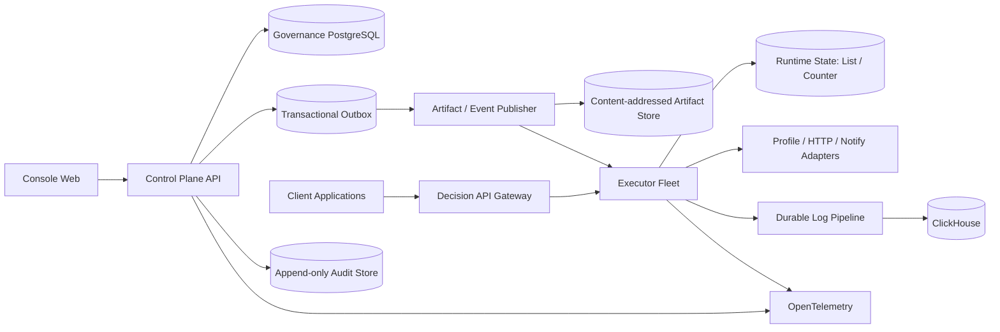

# 技术架构与领域设计拆分评审

- 评审日期：2026-08-03
- 评审对象：`docs/2026-05-24-decision-engine-saas-technical-architecture.md`
- 评审目标：判断总体架构是否足以指导工程实现；明确哪些内容属于全局整体设计，哪些必须拆成局部领域详细设计，并给出后续文档清单与优先顺序。

## 1. 结论

现有架构文档的总体方向基本合理：控制面与执行面分离、NestJS 模块化单体、独立 Go 执行服务、产品模型编译为不可变产物、PostgreSQL 保存治理数据、Redis 承载低延迟状态、ClickHouse 承载运行日志，以及使用 Protobuf 固化跨语言协议，这些都可以作为下一版总体架构的基础。

当前主要问题不是技术栈选择，而是架构仍停留在“组件和职责清单”层面。影响正确性、可靠性和安全性的关键语义尚未落到可实现设计，包括：

- 领域对象状态机和数据库约束；
- 发布事务与环境指针一致性；
- 运行产物分发、缓存和冷启动；
- Counter/List 的具体状态算法；
- 日志可靠投递和审计防篡改；
- 多租户纵深隔离；
- API、表达式和 TypeScript/Go 一致性；
- 出站网络、密钥、会话和 Function 沙箱安全；
- 容量、SLO、灾备、迁移和生产部署标准。

推荐结论：

> **保留总体架构方向，但将当前文档收敛为“全局架构基线”，并在 P0 编码前或对应能力实现前，按本文清单补齐局部领域详细设计。**

## 2. 当前架构值得保留的部分

1. **控制面与执行面分离。** 外部决策流量不经过控制面，是正确的低延迟和故障隔离原则。
2. **控制面采用模块化单体。** 在领域模型尚未稳定时避免过早微服务化，有利于事务一致性和开发效率。
3. **编译层与不可变产物。** 产品编辑模型和运行时模型分离，为确定性执行、缓存、回滚和跨语言兼容提供了良好基础。
4. **治理数据和高频日志分库。** PostgreSQL 与 ClickHouse 职责分离方向合理。
5. **跨语言协议显式化。** Protobuf/Connect RPC 比共享隐式 JSON 模型更可控。
6. **已识别表达式、Function、凭据轮换和资源指纹等高风险点。** 这些风险可以直接转化为后续专项设计。

## 3. 文档层级应重新划分

### 3.1 全局整体架构文档应负责什么

全局文档应稳定描述系统级约束，而不是深入每个节点或领域的内部实现。建议包含：

1. 业务背景、架构目标和非目标。
2. 系统上下文、用户/外部系统、信任边界和数据流。
3. 容器/服务边界、依赖方向和数据所有权。
4. 控制面、产物面、执行面、运行状态面和可观测面的关系。
5. 全局质量属性场景：性能、可用性、一致性、安全、恢复、可维护性和成本。
6. 全局技术标准：API、错误、时间、ID、幂等、日志、追踪、配置、秘密和版本兼容。
7. 生产部署拓扑、网络边界、故障域、扩缩容和灾备。
8. 架构决策记录 ADR 索引和局部领域文档索引。

### 3.2 局部领域详细设计应负责什么

每个局部文档围绕一个可独立评审的领域，定义：

- 领域对象、术语和不变量；
- 状态机和合法事件；
- API、命令、查询和事件；
- 数据模型、约束、索引和迁移；
- 事务、并发、幂等和一致性；
- 失败、超时、降级、补偿和恢复；
- 权限、数据分类和威胁控制；
- 指标、日志、追踪和告警；
- 容量、配额和保护限制；
- 测试矩阵、兼容和发布策略。

当前架构文档同时写入模块列表、运行节点、安全、部署和测试，但没有把上述局部语义展开，容易形成“看似覆盖完整、实现时仍需重新设计”的状态。

## 4. 全局架构层面的关键问题

### 4.1 文档基线和决策治理

| ID | 优先级 | 问题 | 建议 |
| --- | --- | --- | --- |
| ARC-B01 | P0 阻塞 | 架构文档声明产品依据为 `docs/plans/2026-02-27-decision-engine-saas-design.md`，仓库实际路径不同 | 修正路径，增加文档版本/commit、状态、owner、最后评审日期和替代关系 |
| ARC-M01 | P0 必须 | 技术选型表把候选项和已冻结项混在一起，例如“Goja 或同类”“CEL 风格” | 每项标注 `Accepted / Trial / Proposed`；关键选择形成 ADR |
| ARC-M02 | P0 必须 | 缺少架构到需求和测试的追踪 | 建立 `requirement -> domain design -> API/schema -> test` 矩阵 |
| ARC-M03 | P0 必须 | 没有明确代码所有权和模块依赖规则 | 定义模块 owner、禁止依赖、公共包边界和架构检查规则 |

### 4.2 质量属性和容量模型缺失

目前仅列举 QPS、p95/p99 等指标名称，没有架构场景和容量假设，无法判断组件规格或验证设计。

P0 需要冻结至少以下假设：

- 租户数、活跃租户数、flow 数、每 flow 版本数；
- 平均/最大节点数、分支数、表达式数、决策表行列数、产物大小；
- 平均/峰值 QPS、突发倍数、请求体和响应体大小；
- 外部画像调用比例和延迟分布；
- List key 数、TTL 分布、Counter 基数、窗口数和热点程度；
- 执行日志每请求大小、写入吞吐、保留期和查询模式；
- 发布频率、同时预热产物数、冷启动恢复目标；
- 可用性、错误预算、RPO、RTO 和单区域/多可用区要求。

| ID | 优先级 | 问题 | 建议 |
| --- | --- | --- | --- |
| ARC-B02 | P0 阻塞 | 无容量模型和质量属性场景 | 用可测场景定义 SLO、负载、故障和恢复；架构选型以场景验证而不是定性描述 |
| ARC-M04 | P0 必须 | 不清楚 200ms 预算如何分配给鉴权、加载、表达式、Redis 和外部画像 | 建立端到端延迟预算和依赖超时预算 |
| ARC-M05 | P0 必须 | 无资源成本保护 | 定义 tenant/client/flow/node 维度配额、限流、最大产物、最大输出和日志截断 |

### 4.3 执行热路径仍依赖 PostgreSQL

总体图和 `executor-go` 边界允许执行面直接从 PostgreSQL 做运行配置只读查询和缓存加载。若冷缓存、缓存失效或数据库抖动时需要访问控制面主库，则控制面故障仍会进入实时决策链路，也会放大发布和租户高峰对数据库的影响。

**建议的全局原则：**

- PostgreSQL 是治理和发布事务的 source of truth，但不是稳态请求热路径依赖。
- 发布产物采用内容寻址，例如 `artifact_hash`，写入耐久产物存储。
- executor 只依赖本地/内存缓存、专用产物存储或受控分发服务加载不可变产物。
- 当前环境指针有单一权威 revision；请求只会执行完整旧产物或完整新产物，不读取半发布状态。
- 冷启动、产物存储不可用和指针订阅延迟均有明确策略。

| ID | 优先级 | 问题 | 建议 |
| --- | --- | --- | --- |
| ARC-B03 | P0 阻塞 | executor 在冷路径访问控制面 PostgreSQL，隔离目标不完整 | 设计独立产物分发与本地缓存；稳态决策不访问控制面主库 |
| ARC-B04 | P0 阻塞 | 产物存储位置、canonical 编码、hash、签名、兼容版本和完整性校验未定义 | 建立版本化 Artifact Envelope 和确定性序列化 |
| ARC-M06 | P0 必须 | 冷启动和缓存 miss 行为不明确 | 定义加载 deadline、并发去重、负缓存、旧版本继续服务和失败码 |

### 4.4 发布、指针和缓存的一致性未落地

文档用“原子切换环境生效指针”和“缓存失效”概括发布过程，但 PostgreSQL 事务、Redis 缓存和多个 executor 实例之间不存在天然的跨系统原子操作。

建议采用：

1. PostgreSQL 事务写入发布记录、活动指针 revision 和 outbox event。
2. outbox publisher 可靠发布 `ActiveArtifactChanged` 事件。
3. executor 通过订阅或轮询获取单调递增 revision，加载并校验新产物。
4. 只有产物完整可用后才替换本地指针；加载失败继续服务旧版本并告警。
5. 外部语义明确为“发布事务提交后，在传播 SLA 内逐步收敛”，或增加发布 barrier 等待目标实例预热完成。
6. 所有命令使用幂等键和乐观并发，防止重复发布、并发回滚和旧请求覆盖新指针。

| ID | 优先级 | 问题 | 建议 |
| --- | --- | --- | --- |
| ARC-B05 | P0 阻塞 | 数据库提交与队列任务之间存在丢事件窗口 | 使用 transactional outbox，不允许“先提交后尽力 enqueue” |
| ARC-B06 | P0 阻塞 | 多实例缓存收敛和请求可见性语义未定义 | 定义 revision、传播 SLA、旧版本服务策略和发布完成判定 |
| ARC-M07 | P0 必须 | 回滚与发布并发行为不明确 | 采用 compare-and-swap/expected revision，拒绝过期命令 |
| ARC-M08 | P0 必须 | 预热成功和正式可服务未区分 | 定义加载、校验、ready、activate 四个阶段及状态 |

### 4.5 Redis 职责过载

同一 Redis 被规划用于名单、Counter、缓存、限流和 BullMQ。这些负载在持久化、淘汰、延迟、容量和故障影响上完全不同：

- 名单/Counter 是业务运行状态，需要明确持久化和禁止意外淘汰；
- 产物/API Key 缓存允许丢失并可重建；
- 限流是短生命周期状态，可接受不同一致性；
- BullMQ 是任务系统，需要独立容量和阻塞/重试策略。

**建议：** 生产至少拆分为 `runtime-state Redis`、`ephemeral-cache/rate-limit Redis` 和 `queue Redis` 三类故障域。开发环境可以共用容器，但配置和 keyspace 仍按未来边界组织。仅使用逻辑 DB 不能隔离内存淘汰、主线程阻塞和实例故障。

| ID | 优先级 | 问题 | 建议 |
| --- | --- | --- | --- |
| ARC-B07 | P0 阻塞 | List/Counter 的耐久状态与可丢缓存/队列共享故障域 | 生产拆分 Redis 角色，并分别定义 persistence、eviction、backup 和 SLO |
| ARC-B08 | P0 阻塞 | Counter 算法和数据写入来源缺失 | 单独设计事件模型、窗口算法、原子操作、去重、热点和容量 |
| ARC-M09 | P0 必须 | List key 模型只停留在概念 | 定义规范化、编码、TTL、原子 refresh、基数限制、批处理和环境隔离 |
| ARC-M10 | P0 必须 | key 命名只有前缀建议，没有版本和最大长度 | 制定 key schema、版本、hash 策略和兼容迁移方式 |

### 4.6 执行日志“异步写 + 补偿”缺少可靠源

executor 直接异步写 ClickHouse 后，如果进程崩溃或网络异常，`control-worker` 并没有原始日志事件可供补偿。“补偿任务”只有在事件先被持久化到可靠介质时才成立。

可选实现包括：

- executor 本地磁盘 WAL + 批量上传；
- 专用流/消息系统；
- 具有明确持久化和容量保护的 Redis Streams；
- 日志代理/sidecar 采集 stdout 或本地文件，再可靠投递。

无论选择哪种方案，都需定义最多丢失量、背压、磁盘满、重复投递、ClickHouse 不可用、乱序和租户删除。

| ID | 优先级 | 问题 | 建议 |
| --- | --- | --- | --- |
| ARC-B09 | P0 阻塞 | 执行日志补偿没有 durable source | 增加可靠日志管道和 at-least-once/允许丢失语义 |
| ARC-M11 | P0 必须 | ClickHouse 表设计、分区、排序、TTL 和删除策略缺失 | 按查询与租户删除需求设计表、materialized views 和 retention |
| ARC-M12 | P0 必须 | 审计日志和执行日志边界不清 | 审计使用强一致 append-only 路径；执行日志使用高吞吐异步路径 |

### 4.7 多租户隔离不能只依赖应用过滤

“所有查询强制 tenant_id 过滤”是必要条件，但不足以成为 SaaS 的唯一隔离层。一个遗漏条件或错误 join 即可造成跨租户泄露。

建议纵深防御：

- tenant_id 进入主键/唯一约束/外键，禁止跨租户引用；
- PostgreSQL 采用 RLS 或等价数据库级策略保护高风险表；
- 仓储层必须显式接收 TenantContext，禁止无租户 repository；
- 后台任务、缓存、ClickHouse 查询、导出和日志同样隔离；
- 建立生成式/属性测试，持续尝试跨租户对象 ID；
- 管理和 break-glass 访问使用独立角色、审批和审计。

| ID | 优先级 | 问题 | 建议 |
| --- | --- | --- | --- |
| ARC-B10 | P0 阻塞 | 多租户隔离只有应用约定 | 增加数据库约束/RLS、缓存隔离、任务隔离和自动化隔离测试 |
| ARC-M13 | P0 必须 | ClickHouse 和 Redis 中的租户删除/导出未定义 | 形成数据生命周期和删除传播设计 |
| ARC-M14 | P0 必须 | 租户配额与 noisy-neighbor 控制不足 | 对执行、状态、日志、队列和连接器分别限额 |

### 4.8 身份、API Key 与内部服务认证设计不足

#### 控制台 Session

“内置账号 + JWT Session”没有说明 JWT 放在 cookie 还是 bearer、CSRF、防重放、过期、refresh rotation、撤销、设备会话、密码恢复、MFA 和暴力破解保护。

#### API Key

需要定义 Key 格式、随机熵、hash 算法、查找索引、client/flow scope、重叠轮换、撤销缓存失效和泄露响应。默认不应长期保存可再次解密的完整 Key。

#### 服务间认证

Connect RPC 不应只依赖网络可达性。生产需要 mTLS 或工作负载身份，并校验调用服务、租户上下文来源和请求重放。

| ID | 优先级 | 问题 | 建议 |
| --- | --- | --- | --- |
| ARC-B11 | P0 阻塞 | 控制台 Session 安全模型未定义 | 单独设计 cookie/bearer、CSRF、refresh、撤销、MFA 和密码生命周期 |
| ARC-B12 | P0 阻塞 | API Key 无 client/flow scope 和重叠轮换模型 | 引入 Client Principal、最小权限 scope、hash-only 和 grace period |
| ARC-M15 | P0 必须 | 内部 RPC 无服务身份和传输安全要求 | 生产采用 mTLS/工作负载身份、授权和防重放 |

### 4.9 出站 HTTP/Notify 面临 SSRF 和供应链风险

连接器允许租户配置 base URL 和相对 path，且资源连通性测试“不做平台级目标白名单”。这会暴露 SSRF、DNS rebinding、云元数据访问、内网探测、重定向绕过、响应炸弹和成本滥用风险。

建议：

- 所有外联经统一 egress policy/proxy；
- 仅允许 HTTPS（除受控私有化场景）；
- 解析和连接阶段阻止 loopback、link-local、RFC1918、云元数据和保留地址；
- 每次重定向重新验证目标；限制重定向次数；
- 明确 DNS 解析和重绑定防护；
- 限制端口、方法、请求/响应大小、Content-Type、压缩比、超时和并发；
- 供应商响应按不可信输入处理并做 Schema/内容验证；
- 使用租户/连接器级熔断、配额和审计。

| ID | 优先级 | 问题 | 建议 |
| --- | --- | --- | --- |
| ARC-B13 | P1 前阻塞 | HTTP/Notify 没有 SSRF 和 egress 安全设计 | 高级节点实现前完成出站网络专项设计 |
| ARC-M16 | P1 前必须 | 第三方 API 响应被隐式信任 | 限制、验证、截断、脱敏并隔离解析失败 |
| ARC-M17 | P1 前必须 | 外呼重试可能放大费用和副作用 | 定义幂等、重试预算、退避、熔断和成本配额 |

### 4.10 表达式与跨语言契约仍然模糊

“CEL 风格表达式”不是可实现规范。编辑态 TypeScript 与运行态 Go 各做一套语法/类型实现，非常容易漂移。

建议：

- 选定具体 CEL 实现和版本，或定义严格的 BRDE Expression Spec；
- canonical AST 由后端编译，前端不作为权威解释器；
- 明确类型、numeric widening、时间、列表、map、null/absence、错误和确定性；
- 生成跨语言 conformance fixture，所有实现必须运行同一测试集；
- 产物记录表达式语言版本，升级时支持旧版本运行。

Protobuf 需要使用兼容性工具和规则：禁止字段号复用，删除字段保留 reserved，明确 package/version 和 breaking policy。

| ID | 优先级 | 问题 | 建议 |
| --- | --- | --- | --- |
| ARC-B14 | P0 阻塞 | `CEL 风格` 无精确定义 | 冻结实现、版本、子集、类型和错误语义 |
| ARC-B15 | P0 阻塞 | TypeScript/Go 双实现只有“fixture 对齐”方向，没有权威模型 | 后端产生 canonical AST/typed IR；建立强制 conformance suite |
| ARC-M18 | P0 必须 | Protobuf 兼容策略未定义 | 采用 Buf 或等价 breaking check、reserved 和版本包策略 |

### 4.11 Function 沙箱不宜直接内嵌实时执行进程

在多租户实时服务中，把不可信脚本直接运行在 executor 进程内，会让 CPU、内存、运行时漏洞和进程崩溃影响其他租户。纯 Go VM 便于嵌入，但不是强安全边界。

此外，文档要求入口为 `async handler(input)`，但 Goja 本身不提供浏览器/Node 的事件循环；在禁止 IO 的前提下，async 语义也没有明确价值。

建议：

1. P0 不实现 Function。
2. P1 先决定是否只支持同步纯函数 `handler(input)`。
3. 生产执行使用独立进程/worker pool，必要时容器或 microVM，设置 cgroup/rlimit/seccomp、强制终止和进程回收。
4. 声明输入输出 Schema、最大源码/依赖/输出、CPU 和墙钟预算。
5. 不允许动态依赖；白名单模块随平台版本固定并进入产物指纹。

| ID | 优先级 | 问题 | 建议 |
| --- | --- | --- | --- |
| ARC-B16 | P1 前阻塞 | Function 在 executor 进程内，缺少强隔离 | 移至隔离执行池或延后；完成逃逸、资源和故障模型评审 |
| ARC-M19 | P1 前必须 | `async handler` 与所选运行时能力不匹配 | 改为同步纯函数，或明确事件循环和 Promise 驱动语义 |

### 4.12 数据模型、状态机和迁移不足

架构只列出对象名称和 JSONB 使用方式，没有 ERD、主外键、唯一约束、状态约束、索引、乐观锁、软删除和迁移策略。发布治理是强一致领域，不能主要依赖任意 JSONB 和服务层判断。

建议：

- 核心身份、状态、关系、revision 和时间使用关系列与数据库约束；
- JSONB 用于不可变快照和节点配置，不承载需要频繁过滤或保障唯一性的字段；
- 所有状态机通过状态 + version/CAS 更新；
- 定义 expand/migrate/contract 的零停机迁移策略；
- 新旧 control-api/executor/产物格式在滚动升级期间兼容。

| ID | 优先级 | 问题 | 建议 |
| --- | --- | --- | --- |
| ARC-B17 | P0 阻塞 | 缺少核心 ERD、约束和状态机 | P0 编码前完成数据模型和迁移设计 |
| ARC-M20 | P0 必须 | Draft、资源和凭据并发更新方式未定义 | 使用 revision/ETag/optimistic lock，返回可恢复冲突 |
| ARC-M21 | P0 必须 | 无零停机数据库和协议演进策略 | 定义双写/回填/兼容窗口和回滚限制 |

### 4.13 生产部署、灾备和运行手册不完整

“Kubernetes + 托管数据库”只是部署方向，不是生产架构。至少需要：

- ingress、TLS、WAF/API gateway 和内部网络策略；
- mTLS/工作负载身份、Secret 注入和配置分层；
- readiness/liveness/startup probe、优雅终止和 drain；
- requests/limits、PDB、反亲和、拓扑分散、HPA/KEDA；
- 多可用区、数据库备份/PITR、Redis 和 ClickHouse 恢复策略；
- 发布 rollout、兼容、回滚和数据库迁移顺序；
- 依赖故障、缓存雪崩、日志积压、磁盘满、Key 泄露等 runbook；
- 定期 restore drill 和故障演练。

| ID | 优先级 | 问题 | 建议 |
| --- | --- | --- | --- |
| ARC-B18 | P0 上线阻塞 | 无 RPO/RTO、备份和恢复验证 | 冻结灾备目标并自动化备份，发布前完成恢复演练 |
| ARC-M22 | P0 上线必须 | K8s 缺少探针、PDB、资源和优雅终止设计 | 形成生产 deployment baseline |
| ARC-M23 | P0 上线必须 | 无多可用区和故障域说明 | 明确各组件拓扑、单点和降级策略 |

### 4.14 可观测、测试和软件供应链仍需加强

OpenTelemetry 只列了指标名称，没有 trace propagation、字段标准、基数、采样、告警和 SLO 看板。测试策略也主要是单元/集成/E2E，缺少性能、安全、故障和恢复验证。

P0 工程门禁建议包含：

- 单元、集成、契约和端到端测试；
- TypeScript/Go 编译与表达式 conformance；
- 负载、峰值、长稳、容量和热点 key 测试；
- 故障注入：PG/Redis/ClickHouse/画像不可用、延迟和部分失败；
- 租户隔离、权限矩阵、SSRF、认证、秘密和审计测试；
- 数据库迁移、回滚、备份恢复和滚动升级测试；
- 依赖锁定、SBOM、漏洞/秘密/SAST/镜像扫描；
- 构建 provenance、镜像签名和部署验证。

| ID | 优先级 | 问题 | 建议 |
| --- | --- | --- | --- |
| ARC-B19 | P0 阻塞 | 关键语义缺少跨语言和故障测试 | 把 conformance、failure、isolation 纳入首批 CI |
| ARC-M24 | P0 必须 | Trace 和日志字段无统一语义 | 定义 context propagation、semantic conventions、采样和基数预算 |
| ARC-M25 | P0 必须 | 软件供应链安全未覆盖 | 按 NIST SSDF/SLSA 建立依赖、构建、签名、SBOM 和发布门禁 |

## 5. 建议的全局总体架构

建议在下一版全局架构中把系统明确分为五个逻辑平面：



### 5.1 控制面

负责租户、身份权限、Draft、版本、资源、凭据、审批、发布事务和审计，不承载外部实时决策流量。

### 5.2 产物面

负责 canonical compile、artifact hash、完整性/签名、耐久存储、发布 revision、预热和分发。它是当前文档缺失但最关键的桥梁。

### 5.3 执行面

只消费不可变产物和运行时状态。稳态请求不访问治理数据库；每个请求记录实际 artifact hash/version，并在 deadline 内完成或明确失败。

### 5.4 运行状态面

List、Counter、限流、缓存和队列按耐久性和故障域分离。所有 key、配额和指标包含租户边界。

### 5.5 可观测与审计面

执行日志高吞吐异步写入，但经可靠管道；控制面审计强一致 append-only。两者使用统一 request/trace/tenant/flow/artifact 关联键，但保留不同的数据保留和安全策略。

## 6. 需要逐份补充的局部领域详细设计清单

以下列表即后续建议逐文档补充的 backlog。文件名仅为建议，可按仓库规范调整。

### 6.1 P0-A：核心编码前必须完成

| ID | 建议文档 | 核心内容 | 主要依赖 |
| --- | --- | --- | --- |
| D01 | `docs/architecture/domains/01-core-domain-and-state-machines.md` | Tenant、Flow、Draft、Version、Build、ReleaseApplication、Approval、ReleaseRecord、ActivePointer、Resource、Credential、ApiKey、Audit 的对象关系、不变量和状态机 | PRD 术语与范围 |
| D02 | `docs/architecture/domains/02-flow-model-compiler-and-artifact.md` | 合法图语法、节点/边限制、namespace、静态校验、canonical IR、确定性编译、Artifact Envelope、hash 和格式兼容 | D01 |
| D03 | `docs/architecture/domains/03-expression-language-and-type-system.md` | 精确语言/版本、AST、类型、null/absence、函数、错误、确定性和 TS/Go conformance | D02 |
| D04 | `docs/architecture/domains/04-external-decision-api.md` | OpenAPI、Client Principal、鉴权、scope、错误、deadline、限流、幂等、版本、追踪和兼容 | D01、身份原则 |
| D05 | `docs/architecture/domains/05-control-plane-data-model-and-migrations.md` | ERD、表/列、PK/FK/unique/check、tenant 约束、RLS、JSONB 边界、索引、revision、软删除和零停机迁移 | D01 |
| D06 | `docs/architecture/domains/06-core-six-node-runtime-contracts.md` | Request、Profile Query、List(query)、Counter、Decision Table、Response 的输入输出、错误、超时、降级、日志和 fixture | D02、D03 |

### 6.2 P0-B：Test 发布闭环前必须完成

| ID | 建议文档 | 核心内容 | 主要依赖 |
| --- | --- | --- | --- |
| D07 | `docs/architecture/domains/07-release-approval-and-rollback.md` | 申请/审批/发布/失败/重试/回滚状态机、CAS、幂等、职责分离、审批快照和事务 outbox | D01、D05 |
| D08 | `docs/architecture/domains/08-artifact-storage-distribution-and-cache.md` | source of truth、content addressing、签名、预热、revision、缓存替换、冷启动、旧版本服务、故障回退和传播 SLA | D02、D07 |
| D09 | `docs/architecture/domains/09-runtime-state-list-counter-and-rate-limit.md` | Redis 拓扑、key schema、List TTL/原子操作/环境隔离、Counter 写入路径/窗口算法/去重/热点、限流 | D04、D06 |
| D10 | `docs/architecture/domains/10-tenant-identity-access-and-api-key.md` | 账号/session、MFA 边界、TenantContext、RBAC/高风险能力、数据库隔离、Client Principal、Key 创建/轮换/撤销 | D01、D04、D05 |
| D11 | `docs/architecture/domains/11-observability-execution-log-and-audit.md` | trace context、事件 Schema、脱敏、可靠投递、ClickHouse 表/TTL、审计 append-only、告警和租户删除 | D01、D08 |
| D12 | `docs/architecture/domains/12-security-threat-model.md` | 数据流和信任边界、STRIDE、认证授权、秘密、加密、SSRF、DoS、依赖、管理面和 break-glass | D04、D09、D10、D11 |
| D13 | `docs/architecture/domains/13-test-conformance-performance-and-resilience.md` | 测试金字塔、共享 fixture、契约兼容、性能/长稳、故障注入、租户隔离、迁移、恢复和发布准入 | D02-D12 |

### 6.3 P1：副作用与高级节点实现前完成

| ID | 建议文档 | 核心内容 | 主要依赖 |
| --- | --- | --- | --- |
| D14 | `docs/architecture/domains/14-http-connector-and-egress-security.md` | 连接器模型、环境解析、SSRF/DNS/redirect、egress proxy、Schema、超时、重试、熔断、配额 | D12 |
| D15 | `docs/architecture/domains/15-notification-domain.md` | 通道适配、提交/送达状态、provider ID、去重、回执、费用、模板、失败运营和审计 | D14 |
| D16 | `docs/architecture/domains/16-side-effects-idempotency-retry-and-compensation.md` | List 写、HTTP、Notify 的幂等键、重试分类、至少一次语义、补偿、测试模式和副作用证据 | D09、D14、D15 |
| D17 | `docs/architecture/domains/17-credential-encryption-and-lifecycle.md` | Credential Object/Version、DEK/KEK/AAD、KMS、轮换、回滚、缓存、访问、备份和重加密 | D10、D12 |
| D18 | `docs/architecture/domains/18-function-sandbox.md` | 运行时选择、同步/异步、进程隔离、资源限制、模块白名单、Schema、终止、漏洞和故障影响 | D02、D12、D13 |
| D19 | `docs/architecture/domains/19-resource-governance-and-fingerprints.md` | 内部 revision、行为字段、canonical fingerprint、保护状态、复制、影响分析、历史回滚解析 | D01、D07、D08 |
| D20 | `docs/architecture/domains/20-editor-draft-concurrency-and-recovery.md` | 前端状态分层、autosave、ETag/revision、冲突、断网、恢复、多标签页、可访问性和大图性能 | D01、D02、D05 |
| D21 | `docs/architecture/domains/21-deployment-dr-and-runbooks.md` | K8s baseline、网络、mTLS、扩缩、PDB、多 AZ、备份/PITR、restore drill、发布顺序和 runbook | 全部 P0 设计 |

### 6.4 后续平台化阶段

| ID | 建议文档 | 核心内容 |
| --- | --- | --- |
| D22 | `docs/architecture/domains/22-saas-tenant-lifecycle-quotas-and-billing.md` | 自助租户、套餐、计量、账单、配额、停用、导出、删除和区域化 |
| D23 | `docs/architecture/domains/23-profile-provider-adapters.md` | 自定义画像源、供应商适配、Schema 版本、缓存、熔断、数据合规和迁移 |
| D24 | `docs/architecture/domains/24-replay-monitoring-experiments.md` | 请求回放、历史轨迹、指标查询、灰度、A/B、效果评估和数据闭环 |

## 7. 局部设计文档统一模板

建议所有 D01-D24 使用同一结构，减少遗漏：

```text
1. Status / Owner / Reviewers / Related ADRs
2. Context and problem statement
3. Goals / Non-goals / Assumptions
4. Terms, domain model and invariants
5. State machines and sequence diagrams
6. Public/internal APIs, commands, queries and events
7. Data model, constraints, indexes and retention
8. Transaction, concurrency, idempotency and consistency
9. Failure modes, timeout, degradation, retry and recovery
10. Security, privacy, tenant isolation and threat controls
11. Observability, audit, SLO and alerts
12. Capacity model, quotas and protection limits
13. Compatibility, migration, rollout and rollback
14. Test matrix and acceptance criteria
15. Alternatives and rejected options
16. Open decisions and decision deadline
```

每份文档至少应包含：

- 一张领域对象/状态图；
- 一张关键成功路径时序图；
- 一张失败或恢复路径时序图；
- API/事件 Schema；
- 数据库或状态存储约束；
- 明确的测试用例编号；
- 未决策项和 owner。

## 8. 推荐的文档与编码顺序

1. 先完成 D01-D06，冻结产品对象、图/表达式、数据模型、外部 API 和核心节点契约。
2. 同步建立 monorepo、代码生成、迁移、CI 和架构规则，但避免提前实现尚未冻结的节点语义。
3. 完成 D07-D13 后实现发布闭环、运行状态、身份安全、日志审计和测试准入。
4. P0 通过性能、隔离、故障和恢复验收后，再按 D14-D21 引入副作用能力和生产运维增强。
5. D22-D24 不阻塞 P0，但商业 SaaS 上线前不能长期缺失。

## 9. 架构开发启动判定标准

满足以下条件后，可以认为架构已足以支持 P0 多人并行开发：

- D01-D06 已批准，核心 Schema 和 fixture 进入仓库；
- D07-D13 至少完成可实现设计，关键 ADR 已决策；
- OpenAPI/Protobuf/Artifact Schema 有版本和兼容检查；
- PostgreSQL ERD、迁移和租户隔离策略可执行；
- 发布 outbox、指针 revision 和 executor cache 语义可自动化验证；
- Counter 数据生产路径和 List 环境隔离已经闭环；
- 日志有可靠源，审计有完整性保障；
- 身份、Key、mTLS、SSRF 和密钥加密有安全基线；
- 容量、SLO、RPO/RTO、压测和恢复验收已冻结；
- CI 包含契约、隔离、安全、迁移和供应链门禁。

## 10. 参考基线

- [OpenAPI Specification 3.2.0](https://spec.openapis.org/oas/v3.2.0.html)
- [RFC 9457 — Problem Details for HTTP APIs](https://www.rfc-editor.org/rfc/rfc9457.html)
- [OWASP API Security Top 10 — 2023](https://owasp.org/API-Security/editions/2023/en/0x11-t10/)
- [OWASP Application Security Verification Standard 5.0.0](https://owasp.org/www-project-application-security-verification-standard/)
- [NIST SP 800-218 — Secure Software Development Framework 1.1](https://csrc.nist.gov/pubs/sp/800/218/final)
- [PostgreSQL Row Security Policies](https://www.postgresql.org/docs/current/ddl-rowsecurity.html)
- [SLSA Specification 1.2](https://slsa.dev/spec/v1.2/)
- [Goja README and runtime caveats](https://github.com/dop251/goja)
